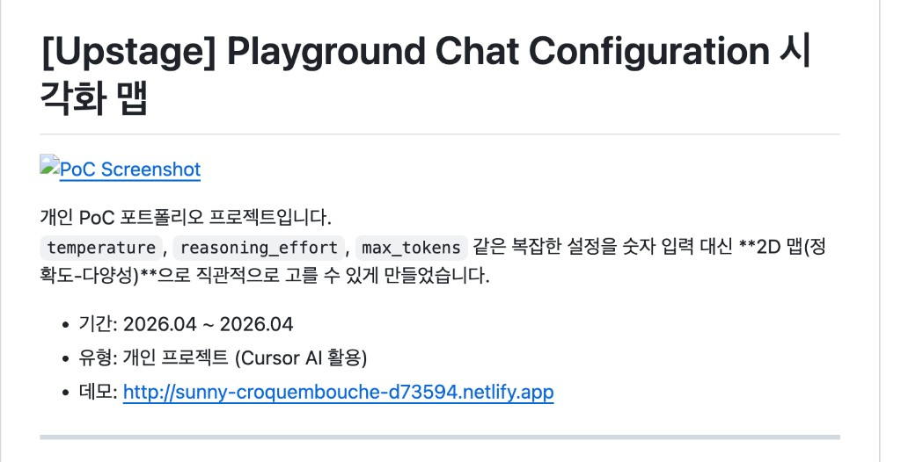

# 🗺️ Model Configuration Canvas — Upstage Playground PoC

[](http://sunny-croquembouche-d73594.netlify.app)

> **"어떤 파라미터를 넣어야 하지?"** 대신, **"원하는 결과가 무엇인지"** 먼저 고르는 LLM 설정 UX 실험입니다.

- 🔗 Live Demo: [sunny-croquembouche-d73594.netlify.app](http://sunny-croquembouche-d73594.netlify.app)
- 📅 기간: 2026.04
- 🧰 도구: HTML, CSS, JavaScript, Cursor AI
- 🎯 대상: Upstage Solar API를 처음 사용하는 개발자/기획자

---

## 왜 만들었나요?

LLM 설정 화면은 보통 `temperature`, `reasoning_effort`, `max_tokens` 같은 파라미터 중심입니다.  
하지만 초심자에게는 "이 숫자가 결과에 어떤 영향을 주는지"가 직관적이지 않습니다.

이 프로젝트는 이 문제를 해결하기 위해,  
**사용자가 목표(정확도/다양성)를 먼저 선택하면 파라미터를 자동으로 매핑**하도록 만들었습니다.

---

## AS-IS vs TO-BE

| 구분 | AS-IS (기존 방식) | TO-BE (이 PoC) |
|---|---|---|
| 시작점 | 파라미터 숫자 입력 | 목표 결과 선택 (2D 캔버스) |
| 의사결정 | 문서/경험 기반 수동 판단 | 시각화 + 실시간 피드백 |
| 비용 인식 | 호출 후 확인 | 선택 즉시 예상 비용 확인 |
| API 연결 | 수동 JSON 작성 | 원클릭 JSON 복사 |
| 온보딩 난이도 | 높음 | 낮음 |

---

## 핵심 기능

- **정확도-다양성 2D 캔버스**
  - 클릭/드래그로 결과 성향 선택
  - 대표 사용 사례 구간(정확한 QA, 코드 생성, 요약/분류, 창의적 글쓰기, 브레인스토밍) 시각화
- **실시간 트레이드오프 표시**
  - Accuracy, Diversity, Speed, 예상 비용을 즉시 업데이트
  - 모델 추천(`solar-mini`, `solar-pro-2`, `solar-pro-3`)과 추천 이유 동시 제공
- **Configuration JSON 원클릭 복사**
  - 선택 지점의 설정값을 JSON으로 즉시 복사
- **기본 접근성 지원**
  - 키보드 화살표 이동, `Shift + Arrow` 빠른 이동 지원

---

## UX/LLM/CTO 관점 설계 포인트

- **하드코딩 최소화**
  - 비용 계산식, 모델 선택 임계값, 좌표 clamp를 `POLICY`로 관리
- **확장성**
  - 정책값 변경만으로 추천 동작 조정 가능
- **유지보수성**
  - 도메인 계산과 렌더 책임을 분리해 변경 영향 범위 축소
- **협업 코드**
  - 동적 UI 갱신에서 안전한 DOM API 중심으로 구성
- **일관성**
  - 입력 -> 계산 -> 출력 흐름을 단일 사이클로 유지

---

## 로컬 실행 방법

이 프로젝트는 단일 HTML PoC입니다.

```bash
open upstage_config_map.html
```

또는 Live Server로 `upstage_config_map.html`을 열면 됩니다.

---

## 프로젝트 구조

```text
config-map/
  ├─ config-map.png
  ├─ upstage_config_map.html
  ├─ README.md
  └─ TEAM_README.md
```

---

## 한계와 다음 단계

- 실제 Solar API 응답 미리보기 연동
- 태스크별 품질 평가 데이터 기반 매핑 보정
- 프리셋(저비용/균형/고정확도) 및 비교 UX 추가
- 정책 외부 파일화(`policy.json`)와 테스트 자동화

---

Built with Cursor AI · 개인 PoC 포트폴리오 프로젝트
