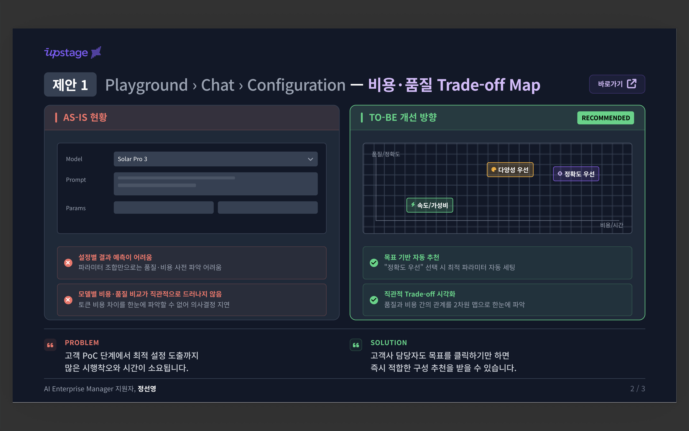

# 🗺️ [Upstage] Playground > Chat > Configuration Map PoC

> **"어떤 파라미터를 넣어야 하지?"** 대신, **"원하는 결과가 무엇인지"** 먼저 고르는 LLM 설정 UX입니다.

🔗 **Live Demo**: [https://sunny-croquembouche-d73594.netlify.app/](https://sunny-croquembouche-d73594.netlify.app/)

---

## 개발 배경

LLM 설정 화면은 보통 `temperature`, `reasoning_effort`, `max_tokens` 같은 파라미터 중심입니다.
하지만 사용자에게는 "이 숫자가 결과에 어떤 영향을 주는지"가 직관적이지 않습니다.

이 프로젝트는 이 문제를 해결하기 위해,  
**사용자가 목표(정확도/다양성)를 먼저 선택하면 파라미터를 자동으로 매핑**하도록 만들었습니다.

---

## AS-IS vs TO-BE

| 구분          | AS-IS (기존 방식)        | TO-BE (이 PoC)             |
| ------------- | ------------------------ | -------------------------- |
| 시작점        | 파라미터 숫자 입력       | 목표 결과 선택 (2D 캔버스) |
| 의사결정      | 문서/경험 기반 수동 판단 | 시각화 + 실시간 피드백     |
| 비용 인식     | 호출 후 확인             | 선택 즉시 예상 비용 확인   |
| API 연결      | 수동 JSON 작성           | 원클릭 JSON 복사           |
| 온보딩 난이도 | 높음                     | 낮음                       |

---

## 핵심 기능

- **정확도-다양성 2D 캔버스**
  - 클릭/드래그로 결과 성향 선택
  - 대표 사용 사례 구간(정확한 QA, 코드 생성, 요약/분류, 창의적 글쓰기, 브레인스토밍) 시각화
- **실시간 트레이드오프 표시**
  - Accuracy, Diversity, Speed, 예상 비용을 즉시 업데이트
  - 모델 추천(`solar-mini`, `solar-pro-2`, `solar-pro-3`)과 추천 이유 동시 제공
- **Configuration JSON 원클릭 복사**
  - 선택 지점의 설정값을 JSON으로 즉시 복사
- **기본 접근성 지원**
  - 키보드 화살표 이동, `Shift + Arrow` 빠른 이동 지원

---

  Built with Cursor AI · 업스테이지 Playground

